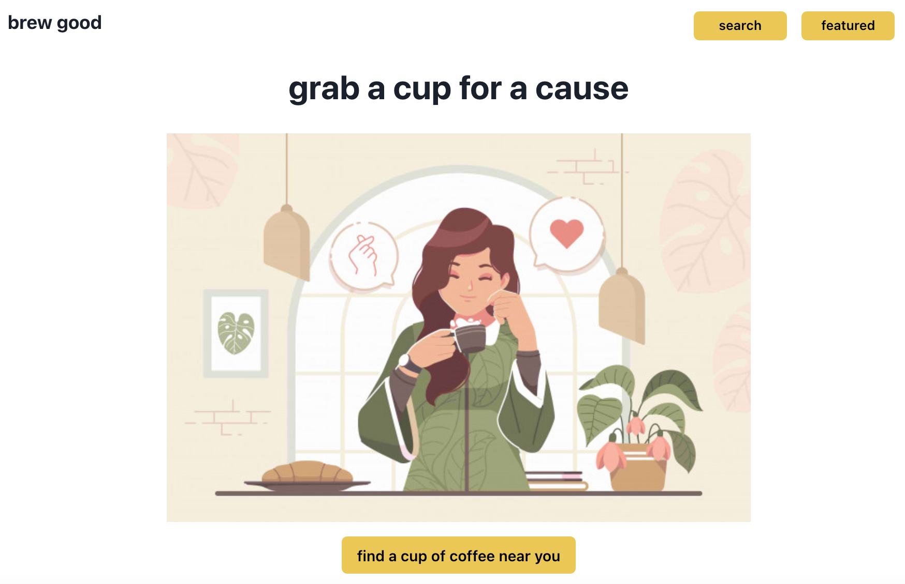

# brew good: frontend

## landing page

## update log

feb 10
* created react app and installed dependencies

feb 11
* added in yelp api
* configured yelp api cors issue, usestate/useffect, etc
* renders list of results

feb 20
* added chakra

feb 21
* yelp search in homepage works (remember to cors-anywhere and allow it to work temporarily)
* testing if the useEffect can run when it updates based on a change in `location` rather than `searchTerm` because the latter takes too many requests
* it did render into the results page (but the wrong cafe data, but images loaded, etc)
* the main issue seems to be that it cannot set the location, but somehow able to set the searchTerm
* if this takes too long, figure out auth and then go back and use dummy data (or a hardcoded location to pull results for example/presentation purposes)
* TOO MANY REQUESTS YELP API
* consider having a homepage that leads to a page to search and then results render within that page (so no need for redirecting - might solve setlocation case because it can be based on location or search results change?)

feb 22
* added a defaultCafes api call for useEffect purposes in the show page
* results come up but need to look into why setCafes/set any state doesn't work right away but when calling `cafes` in the results it shows up
* wrote auth codes to connect frontend to backend for register/login - register not working through form

apr 30
* updated homepage to have featured coffee shop
* added featured page for more details on featured coffee shop
* added footer
* updates to layout/styling

## components

components (view)
* home
* cafes
* cafe container
* featured

components/common
* layout

## debug & stretch goals

notes/to debug
* look into free ways to limit search for "nonprofit" - seems to only be more pro developers

stretch goals
* add fonts via chakra ui
* login/register for users to have favorites

